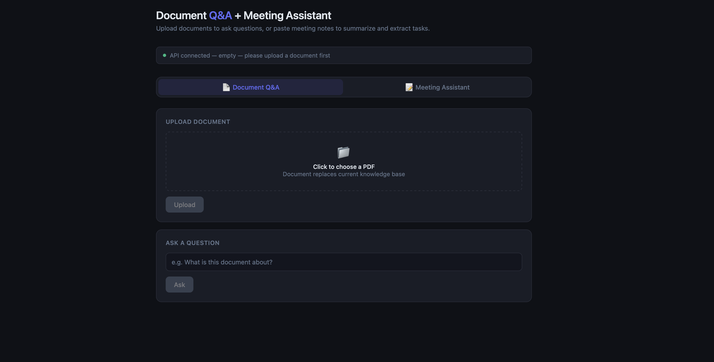
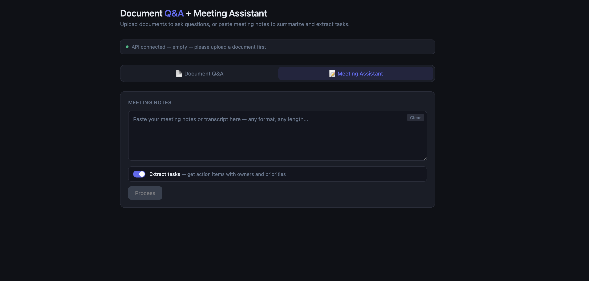

# Document Q&A + Meeting Assistant

An AI-powered internal tool that answers questions about company documents,
summarizes meeting notes, and extracts actionable tasks with owners and priorities.

Built as a RAG (Retrieval Augmented Generation) system using LangChain, ChromaDB, and FastAPI — with a clean browser frontend.

---

## What it does

**Document Q&A**
Upload any PDF and ask questions about it in natural language.
The system retrieves only the relevant sections and answers based
strictly on document content — it won't hallucinate information
that isn't there.

**Meeting Summarizer**
Paste raw meeting notes or a transcript in any format.
Get back a structured summary with key decisions, action items, owners, and next steps.

**Task Extraction**
Toggle on task extraction to get a structured list of action items
with assigned owners, due dates, and priorities — formatted as JSON
ready to feed into any calendar or project management tool.

---

## Demo





---

## Tech Stack

| Component | Technology | Purpose |
|---|---|---|
| API Framework | FastAPI | REST endpoints, automatic Swagger docs |
| RAG Framework | LangChain | Pipeline orchestration |
| Vector Database | ChromaDB | Local semantic search |
| Embeddings | OpenAI text-embedding-ada-002 | Convert text to vectors |
| LLM | GPT-3.5-turbo | Answer and summary generation |
| Frontend | HTML + CSS + JavaScript | Browser UI, served by FastAPI |
| Runtime | Python 3.11 | — |

---

## Architecture

```
PDF Upload
    ↓
PyPDFLoader → text extraction + image-PDF detection
    ↓
RecursiveCharacterTextSplitter → 500 char chunks, 50 char overlap
    ↓
OpenAI Embeddings → vectors
    ↓
ChromaDB → vector storage (replaces previous on each upload)

─── Query time ───

User question → vector → ChromaDB similarity search → top 3 chunks
    ↓
Chunks + question → GPT-3.5-turbo (temperature=0)
    ↓
Grounded answer
```

---

## API Endpoints

| Method | Endpoint | Description |
|---|---|---|
| GET | `/` | Health check + database status |
| POST | `/upload` | Upload PDF to knowledge base |
| POST | `/ask` | Ask a question about uploaded document |
| POST | `/summarize` | Summarize meeting notes |
| POST | `/extract-tasks` | Extract structured task list from meeting notes |
| GET | `/ui` | Browser frontend |

---

## Key Technical Decisions

**Chunk size: 500 characters with 50 character overlap**
Tested sizes from 50 to 1000. Smaller chunks improve retrieval
precision but lose surrounding context, resulting in incomplete answers.
500 with overlap balances precision and completeness.

**Temperature: 0**
Set to 0 for deterministic, factual responses. Higher temperature
increases creativity but also hallucination risk — wrong for a
document Q&A use case.

**Strict prompt constraints**
The prompt explicitly instructs the model to answer only from provided
context. Tested with out-of-scope questions — system correctly returns
"not enough information" rather than falling back to training data.

**Replace-on-upload strategy**
Each upload replaces the entire database. This avoids data consistency
issues where multiple versions of the same document would cause
conflicting answers with the same name but different content.

**Retry with exponential backoff**
All LLM calls are wrapped in retry logic with exponential backoff
(1s, 2s, 4s). Handles transient API failures gracefully without
surfacing errors to the user unnecessarily.

**Input sanitization at API boundary**
All text inputs are sanitized to remove invisible control characters
before processing. This makes the API robust to real-world copy-pasted
text from chat tools and meeting platforms.

---

## Error Handling

- File type validation before processing
- Image-based PDF detection — rejects PDFs with no readable text
- Input sanitization on all text endpoints
- Empty input validation on all endpoints
- Try/except on all LLM and database calls with clean HTTP error responses
- Finally blocks for temp file cleanup on upload
- Retry logic with exponential backoff on all LLM calls

---

## Setup

**Requirements:** Python 3.11, OpenAI API key

```bash
# Clone and enter directory
git clone https://github.com/[yourusername]/document-qa
cd document-qa

# Create virtual environment
python3.11 -m venv venv
source venv/bin/activate

# Install dependencies
pip install -r requirements.txt

# Add your OpenAI API key
echo "OPENAI_API_KEY=your-key-here" > .env

# Run
uvicorn main:app --reload

# Run tests
pytest tests/ -v
```

Open `http://localhost:8000/ui` for the browser interface.
Open `http://localhost:8000/docs` for the Swagger API explorer.

---

## Tech observations

- RAG consistency depends on both LLM temperature AND retrieval
  stability — specific factual questions are more stable than broad
  ones because fewer chunks compete for relevance
- Chunk size affects answer completeness not retrieval accuracy —
  the vector search finds the right location regardless, but small
  chunks don't carry enough surrounding context
- Prompt constraints are the primary defense against hallucination —
  "answer only from context" is more reliable than relying on the
  model's own judgment
- Data consistency in multi-document RAG requires careful design —
  conflicting versions of the same document produce inconsistent answers,
  which led to the replace-on-upload decision
- Real-world text input from chat tools and meeting platforms contains
  invisible control characters that break JSON parsing — input
  sanitization at the API boundary is essential for production robustness
- Structured JSON output from LLM calls requires defensive parsing —
  models don't always return clean JSON even when instructed to

---

## What's next

- [ ] Google Calendar integration via MCP for automatic task scheduling
- [ ] Multi-document support with source tracking and versioning
- [ ] Evaluation framework using RAGAs for automated quality measurement
- [ ] Rate limiting and token usage monitoring
- [ ] Q&A history per document with automatic reset on new upload
- [ ] Make LLM calls async to avoid blocking the event loop under concurrent load