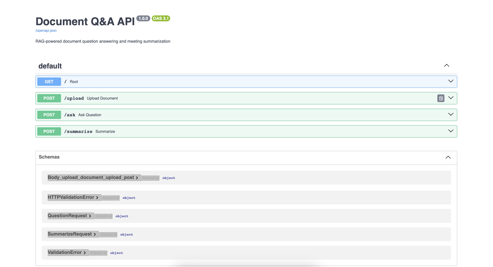

# Document Q&A + Meeting Summarizer

An AI-powered internal tool that answers questions about company documents 
and transforms raw meeting notes into structured summaries.

Built as a RAG (Retrieval Augmented Generation) system using LangChain, 
ChromaDB, and FastAPI.

---

## What it does

**Document Q&A**  
Upload any PDF and ask questions about it in natural language. 
The system retrieves only the relevant sections and answers based 
strictly on document content — it won't hallucinate information 
that isn't there.

**Meeting Summarizer**  
Paste raw meeting notes or a transcript. Get back a structured summary 
with key decisions, action items with owners, and next steps.

---

## Demo



---

## Tech Stack

| Component | Technology | Purpose |
|---|---|---|
| API Framework | FastAPI | REST endpoints, automatic docs |
| RAG Framework | LangChain | Pipeline orchestration |
| Vector Database | ChromaDB | Local semantic search |
| Embeddings | OpenAI text-embedding-ada-002 | Convert text to vectors |
| LLM | GPT-3.5-turbo | Answer generation |
| Runtime | Python 3.11 | — |

---

## Architecture

PDF Upload
↓
PyPDFLoader → text extraction
↓
RecursiveCharacterTextSplitter → 500 char chunks, 50 char overlap
↓
OpenAI Embeddings → vectors
↓
ChromaDB → vector storage
─── Query time ───
User question → vector → ChromaDB similarity search → top 3 chunks
↓
Chunks + question → GPT-3.5-turbo (temperature=0)
↓
Grounded answer

---

## Key Technical Decisions

**Chunk size: 500 characters with 50 character overlap**  
Tested sizes from 50 to 1000. Smaller chunks improve retrieval 
precision but lose surrounding context, resulting in incomplete answers. 
500 with overlap balances precision and completeness.

**Temperature: 0**  
Set to 0 for deterministic, factual responses. Higher temperature 
increases creativity but also hallucination risk — wrong for a 
document Q&A use case.

**Strict prompt constraints**  
The prompt explicitly instructs the model to answer only from provided 
context. Tested with out-of-scope questions — system correctly returns 
"not enough information" rather than falling back to training data.

**Replace-on-upload strategy**  
Each upload replaces the entire database. This avoids data consistency 
issues where multiple versions of the same document would cause 
conflicting answers.

**Retry with exponential backoff**  
LLM calls are wrapped in retry logic with exponential backoff 
(1s, 2s, 4s). Handles transient API failures gracefully.

---

## Error Handling

- File type validation before processing
- Empty/image-based PDF detection
- Input validation on all endpoints  
- Try/except on all LLM and database calls
- Finally blocks for temp file cleanup
- Retry logic with exponential backoff on LLM calls

---

## Setup

**Requirements:** Python 3.11, OpenAI API key

```bash
# Clone and enter directory
git clone https://github.com/[yourusername]/document-qa
cd document-qa

# Create virtual environment
python3.11 -m venv venv
source venv/bin/activate

# Install dependencies
pip install -r requirements.txt

# Add your OpenAI API key
echo "OPENAI_API_KEY=your-key-here" > .env

# Run
uvicorn main:app --reload
```

Open http://localhost:8000/docs to use the interactive API.

---

## What I learned

- RAG consistency depends on both LLM temperature AND retrieval 
  stability — specific factual questions are more stable than broad 
  ones because fewer chunks compete for relevance
- Chunk size affects answer completeness not retrieval accuracy — 
  the vector search finds the right location regardless, but small 
  chunks don't carry enough surrounding context
- Prompt constraints are the primary defense against hallucination — 
  "answer only from context" is more reliable than relying on the 
  model's own judgment
- Data consistency in multi-document RAG requires careful design — 
  conflicting versions of the same document will produce inconsistent 
  answers

---

## What's next

- [ ] Multi-document support with source tracking
- [ ] Task extraction endpoint for calendar integration
- [ ] Evaluation framework using RAGAs for automated quality measurement
- [ ] Rate limiting and token usage monitoring